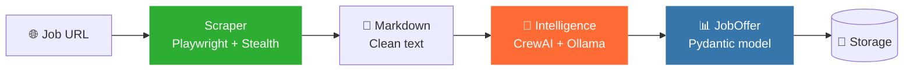

<div align="center">

# 🧠 Mindris AI

**AI-Powered Job Intelligence Platform**

[](https://www.python.org/)
[](https://docs.astral.sh/uv/)
[](https://docs.astral.sh/ruff/)
[](https://www.crewai.com/)
[](https://ollama.com/)
[](https://playwright.dev/)
[](LICENSE)

*Scrape job offers from the web, extract structured intelligence with local AI — 100% offline, 100% private.*

---

[Features](#-features) · [Architecture](#-architecture) · [Quick Start](#-quick-start) · [Self-hosting](#-self-hosting-docker) · [Usage](#-usage) · [Configuration](#%EF%B8%8F-configuration) · [ADRs](#-architecture-decision-records) · [Roadmap](#-roadmap)

</div>

---

## ✨ Features

- 🕵️ **Stealth Web Scraping** — Playwright with anti-Cloudflare bypass (Chrome 125 UA, human simulation, two-pass challenge detection)
- 🧠 **AI-Powered Extraction** — CrewAI agents powered by local Ollama models (Gemma 4) extract structured data from raw HTML
- 📊 **Structured Output** — Type-safe Pydantic models with `AliasChoices` to tolerate LLM key-name drift
- 🔒 **100% Private** — All AI inference runs locally on your GPU — no data leaves your machine
- 📦 **Modular Monorepo** — `uv` workspace with independent services and shared packages
- ✅ **Code Quality** — Full `ruff` ruleset (0 errors), Google-style English docstrings, Python 3.12 native types
- ⚙️ **Centralised Config** — Single `pydantic-settings` source of truth for all runtime configuration

---

## 🏗️ Architecture

```text
mindris-ai/
├── apps/                       # Frontend applications (Next.js)
├── docs/                       # Documentation, ADRs, Roadmap
│   └── adr/                    # Architecture Decision Records
├── packages/                   # Shared libraries (workspace packages)
│   ├── database/               # Pydantic models, JSON schemas
│   └── utils/                  # Logger, centralised config (pydantic-settings)
├── services/                   # Backend services (Modular Monolith)
│   ├── api-gateway/            # API entrypoint & routing (FastAPI)
│   ├── intelligence/           # AI orchestration (CrewAI, LangGraph)
│   ├── renderer/               # PDF rendering engine (Bun/Puppeteer)
│   └── scraper/                # Stealth web scraper (Playwright)
├── storage/                    # Local persistence, browser profiles
├── gemma4-32k.modelfile        # Ollama Modelfile for 32k context
├── run_pipeline.py             # End-to-end pipeline entrypoint
├── pyproject.toml              # Workspace root (uv + ruff config)
└── docker-compose.yml          # Local infrastructure orchestration
```

### Data Flow



---

## 🚀 Quick Start

### Prerequisites

| Tool | Version | Purpose |
|---|---|---|
| [Python](https://www.python.org/) | ≥ 3.12 | Runtime |
| [uv](https://docs.astral.sh/uv/) | latest | Package manager & workspace |
| [Ollama](https://ollama.com/) | ≥ 0.20 | Local LLM inference |
| [Playwright](https://playwright.dev/) | ≥ 1.58 | Browser automation |

### Installation

```bash
# 1. Clone the repository
git clone git@github.com:RashOps/Mindris-AI.git
cd Mindris-AI

# 2. Install all dependencies (workspace-wide)
uv sync --all-packages

# 3. Install Playwright browsers
uv run playwright install chromium

# 4. Pull the base model
ollama pull gemma4:latest

# 5. Create the 32k context variant (run from the project root)
ollama create gemma4:32k -f gemma4-32k.modelfile
```

### Local app without Docker

Install all local dependencies:

```bash
./scripts/setup_local.sh
```

Start the API gateway, renderer and frontend together:

```bash
./scripts/dev_local.sh
```

Smoke check from another terminal:

```bash
./scripts/smoke_local.sh
```

Reinstall dependencies cleanly while keeping lockfiles:

```bash
./scripts/reset_local_deps.sh
```

Run repository-owned validation wrappers:

```bash
./scripts/check_all.sh
```

Full local validation with the stack already running:

```bash
RUN_LOCAL_SMOKE=1 RUN_BROWSER_E2E=1 ./scripts/check_all.sh
```

Detailed guide: [`docs/local-development.md`](docs/local-development.md).

Agent runtime and sandbox guide: [`docs/agent-runtime.md`](docs/agent-runtime.md).

### Environment

Create a `.env` file at the project root:

```env
# Local API
API_KEY="dev-mindris-api-key"
RENDERER_URL="http://localhost:4000"
MAX_PDF_UPLOAD_BYTES="10485760"

# Local Ollama
OLLAMA_API_BASE="http://127.0.0.1:11434"
OLLAMA_NUM_CTX="32768"

# Optional cloud providers. Do not commit real keys.
OPENAI_API_KEY=""
GROQ_API_KEY=""
GEMINI_API_KEY=""
MISTRAL_API_KEY=""
LLAMA_CLOUD_API_KEY=""

# Scraper
SCRAPER_HEADLESS=false
```

> [!NOTE]
> If running Ollama on a separate machine (e.g. Windows host from WSL), replace
> `127.0.0.1` with the host's IP address.

---

## 🐳 Self-hosting Docker

The MVP1 can run locally with Docker Compose:

```bash
cp .env.example .env
docker compose up --build
```

Services:

```text
Frontend  http://localhost:3000
API       http://localhost:8000
Renderer  http://localhost:4000
```

Browser access stays local-first: the web client talks to the API from loopback `localhost`, while operator scripts and external callers still use `X-API-Key`.

Smoke check:

```bash
./scripts/smoke_self_hosting.sh
```

Detailed guide: [`docs/self-hosting.md`](docs/self-hosting.md).

---

## 📜 License and Trademark

Mindris source code is released under the [MIT License](LICENSE).

The `Mindris` name, `Mindris AI` name, logos, wordmarks, and brand identity are not licensed under MIT. You may fork, modify, and use the code, including for commercial purposes under MIT, but you may not use the Mindris branding in a way that suggests official status, endorsement, or affiliation without permission.

Public forks, derivative hosted services, and commercial distributions should rebrand unless they have explicit written approval to use the official Mindris identity.

See [TRADEMARKS.md](TRADEMARKS.md) for the full policy and [brand/README.md](brand/README.md) for the brand asset directory rules.

---

## 🎨 Brand

Mindris now ships with a first-party brand foundation under [`brand/`](brand/).

- Guidelines: [`brand/guidelines/brand-guidelines.md`](brand/guidelines/brand-guidelines.md)
- Design tokens: [`brand/guidelines/design-tokens.json`](brand/guidelines/design-tokens.json)
- Trademark policy: [`TRADEMARKS.md`](TRADEMARKS.md)

The product direction stays operational, clear, and technical rather than decorative or marketing-heavy.

---

## 💡 Usage

### Run the full pipeline

```bash
uv run python run_pipeline.py
```

This will:
1. **Scrape** the target URL with stealth Playwright
2. **Convert** the page to clean Markdown
3. **Analyse** with CrewAI (local Ollama model)
4. **Output** a structured `JobOffer` object with extracted skills

### Example output

```python
{
    'url': 'https://recrutement.axa.fr/nos-offres-emploi/...',
    'title': 'Data Analyst (F/H) en alternance',
    'company': 'JURIDICA',
    'location': 'MARLY LE ROI CEDEX, Yvelines',
    'hard_skills': ['Power Bi', 'Excel', 'SAS', 'SQL', 'R', 'Python'],
    'soft_skills': ['Dynamique', 'Curieux', 'Autonome', "Esprit d'analyse"],
    'experience_level': 'Student',
    'remote_policy': 'On-site',
    'salary_range': None,
}
```

### Scraper standalone

```python
import asyncio
from scraper.core import BaseScraper

async def main():
    async with BaseScraper(headless=False) as s:
        md = await s.get_cleaned_content("https://example.com/job", selector="main")
        print(md)

asyncio.run(main())
```

---

## ⚙️ Configuration

All settings are centralised in `packages/utils/config.py` and read from `.env`:

| Variable | Default | Description |
|---|---|---|
| `API_KEY` | `dev-mindris-api-key` | Local operator API key for CLI, tests, and non-browser callers |
| `RENDERER_URL` | `http://localhost:4000` | Renderer service URL |
| `MAX_PDF_UPLOAD_BYTES` | `10485760` | Maximum accepted PDF upload size |
| `OLLAMA_API_BASE` | `http://127.0.0.1:11434` | Ollama server URL |
| `OLLAMA_NUM_CTX` | `32768` | Context window size |
| `OPENAI_API_KEY` | empty | Optional OpenAI key; never commit real keys |
| `GROQ_API_KEY` | empty | Optional Groq key |
| `GEMINI_API_KEY` | empty | Optional Gemini key |
| `MISTRAL_API_KEY` | empty | Optional Mistral key |
| `LLAMA_CLOUD_API_KEY` | empty | Optional LlamaCloud key for PDF parsing |
| `SCRAPER_HEADLESS` | `true` | Run browser without UI |
| `SCRAPER_TIMEOUT_MS` | `60000` | Page load timeout (ms) |

```python
from utils.config import settings

settings.openai_api_base   # → "http://127.0.0.1:11434"
settings.llm_num_ctx       # → 32768
settings.scraper_headless  # → True
```

---

## 🔍 Code Quality

```bash
# Unit/API tests; LLM smoke tests are skipped unless RUN_LLM_TESTS=1
uv run pytest -q

# Python lint and format checks
uv run ruff check services packages tests run_pipeline.py test_llm.py test_ollama.py
uv run ruff format services packages tests run_pipeline.py test_llm.py test_ollama.py

# Frontend checks
cd apps/web
bun run lint
bun run typecheck
bun run build

# Renderer checks
cd ../../services/renderer
bun run typecheck
bun run build
```

**Active ruff rules:** `E` `F` `I` `N` `W` `B` `UP` `D` `ANN` `T20` `SIM` `C4`  
**Docstring convention:** Google  
**Target version:** Python 3.12  

---

## 📚 Architecture Decision Records

All major technical decisions are documented in [`docs/adr/`](docs/adr/):

| ADR | Title |
|---|---|
| [001](docs/adr/001-core-architecture.md) | Core Architecture |
| [002](docs/adr/002-paradigme-de-programmation-hybride.md) | Hybrid Programming Paradigm |
| [003](docs/adr/003-workspace-restructuring-best-practices.md) | Workspace Restructuring Best Practices |
| [004](docs/adr/004-ai-scraping-pipeline-decisions.md) | AI Scraping Pipeline — 12 Technical Decisions |
| [007](docs/adr/007-local-ci-stabilization.md) | Local and CI Stabilization |

---

## 🗺️ Roadmap

- [x] Stealth web scraper with Cloudflare bypass
- [x] CrewAI pipeline with local Ollama inference
- [x] Structured Pydantic output with alias tolerance
- [x] Centralised config and logger
- [x] Full ruff compliance (227 → 0 errors)
- [ ] FastAPI gateway for HTTP endpoint
- [ ] Supabase/PGVector persistence
- [ ] CV parsing and matching engine
- [ ] PDF resume renderer (Bun/Puppeteer)
- [ ] Frontend dashboard (Next.js)
- [ ] Docker Compose production deployment
- [ ] CI/CD pipeline (GitHub Actions)

---

## 🛠️ Tech Stack

<table>
<tr>
<td align="center"><b>Category</b></td>
<td align="center"><b>Technology</b></td>
</tr>
<tr>
<td>Language</td>
<td>Python 3.12</td>
</tr>
<tr>
<td>Package Manager</td>
<td>uv (workspace mode)</td>
</tr>
<tr>
<td>AI Framework</td>
<td>CrewAI + LangGraph</td>
</tr>
<tr>
<td>LLM Runtime</td>
<td>Ollama (Gemma 4, 5B params, Q4_K_M)</td>
</tr>
<tr>
<td>Web Scraping</td>
<td>Playwright + playwright-stealth</td>
</tr>
<tr>
<td>Data Validation</td>
<td>Pydantic v2 + pydantic-settings</td>
</tr>
<tr>
<td>Linter/Formatter</td>
<td>Ruff</td>
</tr>
<tr>
<td>API (planned)</td>
<td>FastAPI</td>
</tr>
<tr>
<td>Database (planned)</td>
<td>Supabase / PGVector</td>
</tr>
<tr>
<td>Frontend (planned)</td>
<td>Next.js</td>
</tr>
</table>

---

## 📄 License

This project is licensed under the terms of the [MIT License](LICENSE).

---

<div align="center">
<sub>Built with 🧠 by <a href="https://github.com/RashOps">RashOps</a></sub>
</div>
