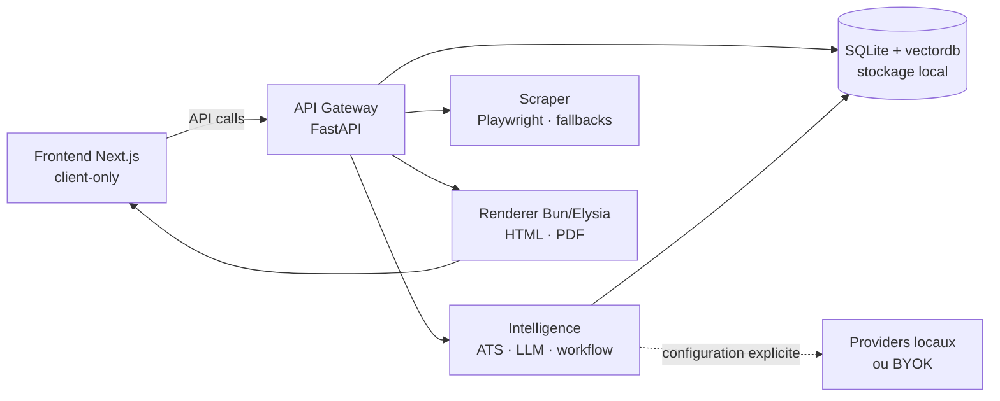

<div align="center">

# Mindris AI

### Le cockpit open source et local-first pour construire, adapter et suivre ses candidatures.

Transformez une offre en candidature complète — CV ciblé, analyse ATS, lettre,
exports et suivi — sans disperser votre travail entre six outils.

[](https://github.com/RashOps/Mindris-AI/actions/workflows/ci.yml)
[](https://github.com/RashOps/Mindris-AI/releases)
[](LICENSE)
[](pyproject.toml)
[](services/renderer/package.json)
[](docs/install.md)
[](scripts/README.md)
[](https://github.com/RashOps/Mindris-AI/stargazers)
[](https://github.com/RashOps/Mindris-AI/issues)
[](https://github.com/RashOps/Mindris-AI/graphs/contributors)

[Découvrir Mindris](#-pourquoi-mindris) ·
[Fonctionnalités](#-un-studio-de-candidature-complet) ·
[Installer](#-choisir-son-mode-dinstallation) ·
[CLI](#-cli-contributeur-multiplateforme) ·
[Contribuer](CONTRIBUTING.md) ·
[Roadmap](docs/roadmap.md)

</div>

---

## Pourquoi Mindris ?

Une recherche d’emploi finit souvent par devenir une chaîne de tâches
répétitives : trouver une offre, copier son contenu, adapter un CV, demander un
score à un outil, générer une lettre, convertir le document, puis recopier les
informations dans un tracker.

Mindris rassemble ce parcours dans un seul espace de travail :

```text
Offre d'emploi
      ↓
Extraction et compréhension du besoin
      ↓
CV ciblé ← Analyse ATS transparente → Suggestions IA
      ↓
Lettre de motivation et exports ouverts
      ↓
Tracker, historique et traçabilité des artefacts
```

Le projet ne cherche pas à devenir un Canva-like. Le CV Builder propose une
personnalisation avancée mais cadrée : des choix visuels utiles, des templates
professionnels et un rendu cohérent entre la preview et le PDF.

## Ce qui rend le projet différent

| Principe | Ce que cela signifie concrètement |
| --- | --- |
| **Local-first** | CV, offres, rapports et historiques restent dans votre stockage local. |
| **Backend-owned** | Secrets, état durable, règles métier et orchestration ne sont pas cachés dans le navigateur. |
| **IA au choix** | Providers locaux ou BYOK : Ollama, OpenAI, Mistral, Gemini, Groq et autres catalogues compatibles. |
| **ATS explicable** | Le score expose ses critères et ses recommandations au lieu d'afficher un nombre opaque. |
| **Exports ouverts** | PDF, DOCX, Markdown, HTML, LaTeX et Typst permettent de garder la maîtrise des documents. |
| **Self-hosted** | Une distribution Docker prête à installer complète le mode développement local. |
| **Traçable** | Jobs, CV, rapports ATS, lettres, versions et événements restent reliés dans l'historique. |

> **Local-first ne veut pas dire “aucun réseau possible”.** Mindris fonctionne
> avec des moteurs locaux, mais peut aussi appeler un provider externe lorsque
> l'utilisateur le configure explicitement. Le choix et les clés restent sous
> son contrôle.

## Un studio de candidature complet

### CV Builder

- modes **Simple**, **Normal** et **Avancé** pour révéler progressivement les
  contrôles ;
- ruban d’actions réductible pour garder la preview centrale ;
- structure, sections et placement en une ou deux colonnes ;
- personnalisation des couleurs, typographies, espacements et détails ;
- dix templates intégrés, du CV ATS minimal au profil académique ou exécutif ;
- import PDF, locales multiples et exports cohérents avec la preview ;
- adaptation du contenu à une offre sans édition libre pixel par pixel.

### Intelligence et offres

- scraping d’offres avec stratégie de fallback ;
- parsing local-first des CV, avec LlamaCloud optionnel ;
- découverte dynamique des modèles disponibles chez les providers ;
- analyse du matching, mots-clés manquants et suggestions contextualisées ;
- agents de réécriture structurés et évalués sur des cas reproductibles ;
- configuration globale ou par tâche des providers et modèles.

### Documents et suivi

- score ATS persistant et relié à l’opportunité ;
- génération et versioning des lettres de motivation ;
- espace Markdown avec preview et export PDF/DOCX ;
- tracker de candidatures ;
- historique unifié des artefacts et runs IA ;
- Workflow, actuellement **Beta**, pour visualiser la candidature de bout en
  bout et les éléments encore manquants.

### Expérience produit

- dashboard de synthèse ;
- guide visuel avec parcours et checklists ;
- thèmes clair et sombre basés sur des tokens partagés ;
- interface française en priorité, avec infrastructure i18n progressive ;
- RuntimeGate qui attend réellement l’API et le renderer avant d’ouvrir le
  workspace.

## Surfaces et maturité

| Surface | Statut | Rôle principal |
| --- | --- | --- |
| Dashboard | Stable | Synthèse, raccourcis et diagnostic du runtime |
| CV Builder | Cœur produit | Création, personnalisation, adaptation et export du CV |
| ATS Score | Stable | Analyse explicable et rapport persistant |
| Markdown PDF | Stable | Lettres, documents libres et exports |
| Tracker | Stable | Suivi des candidatures |
| History | Stable | Ledger job ↔ CV ↔ ATS ↔ lettre ↔ tracker |
| Workflow | **Beta** | Vue orchestrée d’une opportunité et de ses artefacts |
| Guide | Actif | Parcours guidés, bonnes pratiques et checklists |

## Choisir son mode d’installation

### Option A — Self-hosted Docker

Le chemin recommandé pour utiliser Mindris sans préparer le workspace de
développement. Il nécessite Docker Engine/Desktop et Docker Compose v2, mais ni
Python, ni `uv`, ni Bun.

Linux, macOS ou WSL :

```bash
curl -fsSL https://raw.githubusercontent.com/RashOps/Mindris-AI/main/scripts/install_self_hosted.sh | sh
```

Windows PowerShell :

```powershell
irm https://raw.githubusercontent.com/RashOps/Mindris-AI/main/scripts/install_self_hosted.ps1 | iex
```

Le script crée un espace privé dans `~/.mindris-ai`, génère une clé opérateur,
télécharge les images GHCR et lance les trois services.

| Service | URL par défaut |
| --- | --- |
| Application | `http://localhost:3000` |
| API Gateway | `http://localhost:8000` |
| Renderer | `http://localhost:4000` |

Si le port `3000` est occupé :

```bash
curl -fsSL https://raw.githubusercontent.com/RashOps/Mindris-AI/main/scripts/install_self_hosted.sh \
  | MINDRIS_WEB_PORT=3100 sh
```

```powershell
$env:MINDRIS_WEB_PORT = "3100"
irm https://raw.githubusercontent.com/RashOps/Mindris-AI/main/scripts/install_self_hosted.ps1 | iex
```

Consultez le [guide d’installation](docs/install.md) pour la configuration des
providers, la mise à jour, le smoke test et le nettoyage.

### Option B — Développement depuis le dépôt

Prérequis de contribution :

| Outil | Usage |
| --- | --- |
| Python 3.12+ | CLI, API, intelligence, scraper et tests |
| `uv` | Gestionnaire obligatoire du workspace Python |
| Bun | Frontend Next.js et renderer |
| Git | Sources et contrôles de release |
| Docker | Facultatif, pour le packaging self-hosted |

```bash
git clone https://github.com/RashOps/Mindris-AI.git
cd Mindris-AI
./mindris doctor
./mindris setup
./mindris dev
```

Sous Windows :

```powershell
git clone https://github.com/RashOps/Mindris-AI.git
Set-Location Mindris-AI
.\mindris.ps1 doctor
.\mindris.ps1 setup
.\mindris.ps1 dev
```

`uv` est volontairement obligatoire pour les commandes qui touchent au
workspace Python. Les environnements `pip`, Poetry et Conda ne sont pas
supportés pour valider une contribution : le lockfile et la CI doivent rester
la source de vérité.

## CLI contributeur multiplateforme

La CLI est écrite uniquement avec la bibliothèque standard Python. Elle peut
donc diagnostiquer un poste avant l’installation du workspace et fournit les
mêmes intentions sous Linux, macOS, Windows et WSL.

| Commande | Description |
| --- | --- |
| `mindris doctor [--json]` | Vérifie Python, Git, uv, Bun, Docker, ports et services |
| `mindris setup` | Installe le workspace verrouillé et les navigateurs requis |
| `mindris reset-deps` | Réinstalle les dépendances sans toucher aux lockfiles |
| `mindris dev` | Lance et supervise API, renderer et frontend |
| `mindris status` / `stop` | Inspecte ou arrête la stack supervisée |
| `mindris logs [service]` | Filtre les logs par service, date ou request ID |
| `mindris lint` / `test` | Lance les contrôles par scope |
| `mindris check` | Enchaîne la validation complète |
| `mindris smoke` / `e2e` | Vérifie la stack ou le parcours navigateur |
| `mindris docker …` | Pilote Docker Compose depuis un clone |
| `mindris release verify vX.Y.Z` | Vérifie ascendance et égalité des arbres Git |

Lanceurs :

```text
./mindris                 Linux / macOS / WSL
.\mindris.ps1             Windows PowerShell
mindris.cmd               Windows CMD
python3 scripts/mindris.py Appel direct Unix
```

La CLI ne contient aucune logique métier et ne lit jamais les secrets pour les
afficher. Retrouvez toutes les commandes dans le
[guide des scripts](scripts/README.md).

Exemple de diagnostic ciblé :

```bash
./mindris logs api-gateway --since 30m --request-id <request-id>
```

## Architecture



```text
apps/web                 Interface Next.js client-only
services/api-gateway     Contrats produit, routes et persistance
services/intelligence    ATS, providers IA, agents et workflows
services/scraper         Extraction d'offres et stratégies de fallback
services/renderer        Preview HTML et export PDF avec Bun/Puppeteer
packages/database        Modèles SQLite et persistance vectorielle
packages/utils           Configuration, logs et utilitaires runtime
```

### Invariants d’architecture

- Le frontend ne devient jamais un backend ou une couche de service cachée.
- Les secrets, l’état durable et les décisions métier appartiennent au backend.
- Le navigateur communique uniquement via les APIs.
- Les exports passent par le renderer partagé.
- `.logs/` est le répertoire canonique des logs locaux.
- Une route API ne renvoie ni ne journalise une valeur secrète brute.

Plus de détails dans [docs/architecture.md](docs/architecture.md).

## Configuration IA et secrets

Copiez `.env.example` vers `.env` — `mindris setup` le fait automatiquement
lorsque nécessaire — puis configurez uniquement les providers souhaités.

| Variable | Usage |
| --- | --- |
| `API_KEY` | Authentification opérateur locale pour scripts et appels externes |
| `OPENAI_API_KEY` | Modèles OpenAI optionnels |
| `MISTRAL_API_KEY` | Modèles Mistral optionnels |
| `GEMINI_API_KEY` | Modèles Gemini optionnels |
| `GROQ_API_KEY` | Modèles Groq optionnels |
| `LLAMA_CLOUD_API_KEY` | Parsing LlamaCloud optionnel |
| `OLLAMA_API_BASE` | Runtime IA local Ollama |
| `SCRAPER_STRATEGY` | Stratégie de scraping et fallback |

Les secrets sont **write-only** dans l’interface : l’application peut indiquer
qu’une clé est configurée, mais ne renvoie jamais sa valeur brute. Ne partagez
pas la sortie développée d’un Compose contenant un vrai `.env`.

## Qualité, tests et releases

Validation locale recommandée :

```bash
./mindris check
./mindris check --with-smoke --with-e2e
```

La seconde commande suppose que la stack locale est déjà démarrée.

La CI couvre séparément Python, frontend, renderer, Docker et la CLI sur Linux
et Windows.

Les images Docker suivent une politique **build once, promote by digest** :

1. les pull requests valident sans publier ;
2. un tag `vX.Y.Z-rc.N` construit et teste les images candidates ;
3. le tag stable doit appartenir à `main` et partager exactement l’arbre Git du
   RC validé ;
4. `vX.Y.Z` et `latest` sont promus par digest, sans rebuild.

Voir la [politique de release](docs/releases.md) et
[l’ADR 025](docs/adr/025-immutable-release-candidates-and-ghcr-digest-promotion.md).

## Explorer la documentation

| Je veux… | Documentation |
| --- | --- |
| Installer Mindris avec Docker | [Installation one-command](docs/install.md) |
| Développer localement | [Développement local](docs/local-development.md) |
| Comprendre le self-hosting | [Self-hosting Docker](docs/self-hosting.md) |
| Comprendre l’architecture | [Architecture](docs/architecture.md) |
| Utiliser les scripts et la CLI | [Guide des scripts](scripts/README.md) |
| Comprendre le runtime agent | [Runtime agent](docs/agent-runtime.md) |
| Explorer les exports ouverts | [Exports](docs/open-exports.md) |
| Suivre les prochaines phases | [Roadmap](docs/roadmap.md) |
| Lire les décisions techniques | [Architecture Decision Records](docs/adr/) |
| Contribuer | [CONTRIBUTING.md](CONTRIBUTING.md) |

## Roadmap

- continuer le polish visuel et les tests des dix templates CV ;
- élargir l’évaluation des agents d’adaptation sur des cas réels ;
- maturer Workflow avant sa sortie de Beta ;
- généraliser progressivement l’i18n anglaise ;
- simplifier encore le self-hosting pour les utilisateurs non techniques ;
- préparer l’application desktop Tauri dans une phase dédiée.

La roadmap détaillée et les statuts de phase vivent dans
[docs/roadmap.md](docs/roadmap.md).

## Contribuer

Les contributions sont les bienvenues : corrections, tests, documentation,
templates, accessibilité, providers ou idées produit.

Avant d’ouvrir une PR :

```bash
./mindris doctor
./mindris setup
./mindris check
```

Lisez [CONTRIBUTING.md](CONTRIBUTING.md) et [AGENTS.md](AGENTS.md) pour les
invariants du projet et les règles de validation.

## Licence et marque

Le code source est distribué sous licence [MIT](LICENSE).

Le nom Mindris, les logos, wordmarks et éléments d’identité ne sont pas inclus
dans cette licence. Les forks publics, services dérivés et distributions
commerciales doivent se rebrander sauf autorisation écrite. Consultez la
[politique de marque](TRADEMARKS.md).

---

<div align="center">

**Construire une candidature devrait demander de la réflexion, pas vingt copier-coller.**

[Commencer](#-choisir-son-mode-dinstallation) ·
[Voir les releases](https://github.com/RashOps/Mindris-AI/releases) ·
[Contribuer](CONTRIBUTING.md)

</div>
