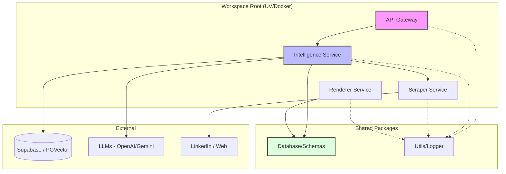

# Architecture du Projet - Mindris AI

Ce document détaille la structure et l'organisation du projet **Mindris AI**, basé sur un modèle de **Monolithe Modulaire**.

## 📂 Vue d'Ensemble du Projet

```text
mindris-ai/
├── apps/               # Applications finales (ex: Frontend Next.js)
├── docs/               # Documentation projet, ADRs et Roadmap
├── packages/           # Bibliothèques partagées (Workspace packages)
│   ├── database/       # Schémas communs (Pydantic, JSON) et modèles
│   ├── ui-components/  # Bibliothèque de composants UI partagée
│   └── utils/          # Utilitaires transverses (Logger, Helpers)
├── services/           # Services backend autonomes (Monolithe Modulaire)
│   ├── api-gateway/    # Point d'entrée API & Routage (FastAPI)
│   ├── intelligence/   # Orchestration IA (CrewAI, LangGraph)
│   ├── renderer/       # Moteur de rendu PDF & UI (Bun/Puppeteer)
│   └── scraper/        # Extraction de données web (Playwright)
├── storage/            # Persistance locale, caches et exports temporaires
├── pyproject.toml      # Configuration racine du workspace (uv)
└── docker-compose.yml  # Orchestration de l'infrastructure locale
```

---

## 🏗️ Schéma Logique de l'Architecture

Le schéma suivant illustre les interactions entre les services et les dépendances externes.



---

## 🛠️ Détail des Composants

### 1. Services (`/services`)
Chaque service est un projet indépendant géré par le workspace `uv`.
- **API Gateway** : Reçoit les requêtes du frontend et les dirige vers le service Intelligence.
- **Intelligence** : Utilise CrewAI pour l'analyse et LangGraph pour les workflows de décision.
- **Scraper** : Encapsule la complexité de Playwright et des stratégies anti-détection.
- **Renderer** : Isolé dans un environnement Bun/TS pour garantir un rendu PDF fidèle via Puppeteer.

### 2. Packages (`/packages`)
- **database** : Point de vérité unique pour les structures de données (Schemas CV, Job Descriptions).
- **utils** : Contient le logger centralisé utilisé par tous les services Python.

### 3. Apps (`/apps`)
- **web** : L'interface utilisateur principale construite avec Next.js.

---

## ⚙️ Standards de Développement
- **Gestion des paquets** : `uv` (Python) et `Bun` (JS).
- **Formatage** : `Ruff` pour Python.
- **Infrastructure** : Isolation via Docker pour assurer la parité entre développement et production.
