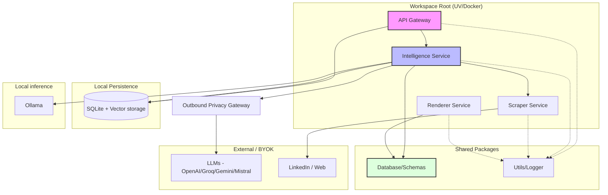

# Architecture du Projet - Mindris AI

Ce document détaille la structure et l'organisation du projet **Mindris AI**, basé sur un modèle de **Monolithe Modulaire**.

## 📂 Vue d'Ensemble du Projet

```text
mindris-ai/
├── apps/               # Applications finales (ex: Frontend Next.js)
├── docs/               # Documentation projet, ADRs et Roadmap
├── packages/           # Bibliothèques partagées (Workspace packages)
│   ├── database/       # SQLite, records, migrations et persistance locale
│   └── utils/          # Utilitaires transverses (Logger, Helpers)
├── services/           # Services backend autonomes (Monolithe Modulaire)
│   ├── api-gateway/    # Point d'entrée API & Routage (FastAPI)
│   ├── intelligence/   # Orchestration IA (CrewAI, LangGraph)
│   ├── renderer/       # Moteur de rendu PDF & UI (Bun/Puppeteer)
│   └── scraper/        # Extraction de données web (Playwright)
├── storage/            # Persistance locale, caches et exports temporaires
├── docker-compose.yml  # Build local depuis le dépôt
├── docker-compose.release.yml # Release self-hosted via GHCR
├── pyproject.toml      # Configuration racine du workspace (uv)
└── README.md
```

---

## 🏗️ Schéma Logique de l'Architecture

Le schéma suivant illustre les interactions entre les services et les dépendances externes.



---

## 🛠️ Détail des Composants

### 1. Services (`/services`)
Chaque service est un projet indépendant géré par le workspace `uv`.
- **API Gateway** : Reçoit les requêtes du frontend, possède les contrats produit, persiste l'état durable et orchestre les routes publiques locales.
- **Intelligence** : Gère le scoring ATS, les lettres, les providers IA et les workflows de décision.
- **Scraper** : Encapsule la complexité de Playwright et des stratégies anti-détection.
- **Renderer** : Isolé dans un environnement Bun/TS pour garantir un rendu PDF fidèle via Puppeteer.

### 2. Packages (`/packages`)
- **database** : Records SQLModel, session SQLite, migrations et stockage vectoriel local.
- **utils** : Settings, logger centralisé et utilitaires runtime partagés.

### 3. Apps (`/apps`)
- **web** : Interface utilisateur principale construite avec Next.js. Elle reste client-only et ne devient pas une couche de service.

---

## Frontières produit

- Le frontend appelle les APIs et rend l'état.
- Le backend possède l'état durable, les secrets, les defaults métier et les actions destructives.
- Le renderer possède le rendu HTML/PDF.
- Les scripts et callers externes utilisent `X-API-Key`.
- Le navigateur local utilise la frontière loopback.
- Les secrets ne doivent pas être exposés dans les réponses API, les logs ou les sorties de commandes.

## Frontière de confidentialité sortante

Les agents ne construisent pas directement un client provider non contrôlé.
Tous les appels cloud d'intelligence, de parsing et de proxy passent par le
gateway de confidentialité backend. Celui-ci applique une politique versionnée,
demande le consentement, filtre la réponse et écrit uniquement un manifeste
sans contenu.

En `local_strict`, l'inférence externe est refusée et l'endpoint Ollama
configuré doit être une destination locale autorisée. Le profil Compose strict
peut en plus rendre le réseau des conteneurs interne. Voir
[Confidentialité](privacy.md) et [Scope C](scope-c-privacy.md).

## Registre des modèles IA

`services/intelligence/model_catalogue.py` compose le catalogue public à partir
des adaptateurs providers et du cache `storage/model-registry.json`. L'API
Gateway ne maintient aucune copie des modèles et le frontend consomme
uniquement `/api/v1/llm/catalogue`.

La découverte réseau est explicite et réservée au backend. Le dernier snapshot
valide reste disponible hors ligne ou pendant une panne provider. Les defaults
de tâches et les fallbacks restent des décisions backend journalisées.

## Distribution

Mindris dispose de deux modes Docker :

- build local : `docker compose up --build` depuis un clone ;
- release self-hosted : installation one-command depuis GHCR via `scripts/install_self_hosted.sh`.

Le Desktop/Tauri est documenté mais reporté : il devra rester un shell local fin
autour des mêmes contrats backend/frontend.

---

## ⚙️ Standards de Développement
- **Gestion des paquets** : `uv` (Python) et `Bun` (JS).
- **Formatage** : `Ruff` pour Python.
- **Infrastructure** : Isolation via Docker pour assurer la parité entre développement et production.
